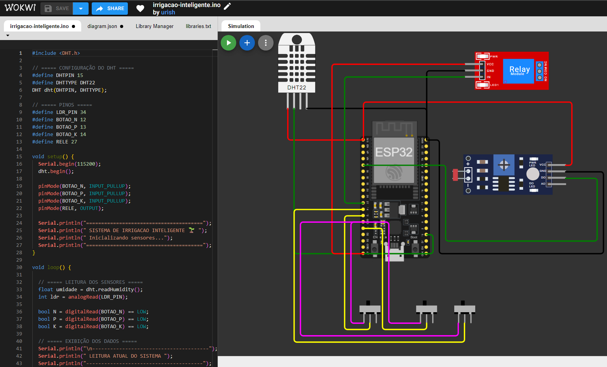

# FIAP - Faculdade de Informática e Administração Paulista

<p align="center">
<a href= "https://www.fiap.com.br/"></a>
</p>

<br>

# 🌱 FarmTech — Irrigação Inteligente (Fase 2 — Capítulo 1)

> Parte do repositório [`ia-fiap`](../../../../README.md). Relacionado ao **CAP6** (produção/perdas) e à **Fase 3** (Oracle + sensores). Ver [`CONEXAO-PROJETOS.md`](CONEXAO-PROJETOS.md).

## 📂 Estrutura

```
CAP1/
├── src/irrigacao-inteligente.ino   # firmware ESP32 / Arduino
├── assets/                         # logo FIAP, foto do circuito
├── document/                       # documentação de IA / projeto
├── links.txt                       # URLs do repo e vídeo
├── CONEXAO-PROJETOS.md             # ligação CAP6 ↔ Fase 3
└── README.md
```

## 👨‍💻 Integrantes
- Heleno Madeira RM570302
- Samanta Silva RM574120
- Matheus Fantini RM574078
- Maykon Souza RM574011

---

## 📌 Descrição do Projeto

Este projeto tem como objetivo desenvolver um sistema de irrigação inteligente, capaz de simular o controle das condições do solo com base em sensores e interação do usuário.

A proposta é utilizar conceitos de Internet das Coisas (IoT) para representar um ambiente agrícola automatizado, onde é possível monitorar e ajustar variáveis importantes para o cultivo.

---

## ⚙️ Funcionamento

O sistema realiza:

- Leitura de temperatura e umidade do ambiente (sensor DHT22)
- Simulação do nível de pH do solo através de um sensor LDR
- Ajuste manual dos níveis de NPK por meio de botões
- Acionamento de um relé (simulando irrigação automática)

Quando os parâmetros estão fora do ideal, o sistema pode indicar a necessidade de irrigação ou ajuste do solo.

---

## 🔧 Componentes Utilizados

- Sensor DHT22 (Temperatura e Umidade)
- Sensor LDR (simulação de pH)
- Botões (controle de NPK)
- Módulo Relé
- Microcontrolador (ESP32 / Arduino)

---

## 💻 Código do Projeto

O código principal está disponível na pasta: /src/irrigacao-inteligente.ino

---

## 📷 Demonstração



---

## 🎥 Vídeo

[▶️ Assista ao vídeo do projeto](https://youtu.be/sTN44EC1dzY?si=krPUUo7e7u52Tcsq)

---

## 📚 Considerações Finais

Este projeto demonstra, de forma prática, como tecnologias simples podem ser aplicadas para resolver problemas do agronegócio, trazendo automação e eficiência para o controle de irrigação.

---

## 🔗 Outras entregas do grupo

| Atividade | Caminho |
|-----------|---------|
| Produção e perdas (CLI + Oracle) | [`../CAP6/`](../CAP6/) |
| Banco de dados — importação e consultas | [`../../FASE3/CAP1/`](../../FASE3/CAP1/) |
| Repositório original deste firmware | [lenomadeira/farmtech-fase2-irrigacao-inteligente](https://github.com/lenomadeira/farmtech-fase2-irrigacao-inteligente) |

