<p align="center">
<a href= "https://www.fiap.com.br/"></a>
</p>

<br>

<br><br>
<br><br>

# Fase 3 — Capítulo 1 — Etapas de uma Máquina Agrícola (Banco de Dados Oracle)

Importação e exploração no Oracle institucional da FIAP dos dados de sensores coletados na Fase 2 (firmware ESP32, capítulo `FASE2/CAP1`) e dos lotes de colheita (CLI Python, capítulo `FASE2/CAP6`).

**Grupo 87 — Graduação ON em Inteligência Artificial — FIAP**

| Integrante                      | RM       |
| ------------------------------- | -------- |
| Heleno Madeira Pereira          | RM570302 |
| Matheus de França Fantini       | RM574078 |
| Samantha Silva Farias           | RM574120 |
| Maykon Eduardo Pereira de Sousa | RM574011 |

**Vídeo demonstrativo (≤ 5 min, YouTube não listado):**
[https://youtu.be/TphD00Zf9NA](https://youtu.be/TphD00Zf9NA)

---

## Sumário

1. [Sobre o projeto](#1-sobre-o-projeto)
2. [Como esta entrega atende o barema](#2-como-esta-entrega-atende-o-barema)
3. [Pré-requisitos](#3-pré-requisitos)
4. [Geração dos dados](#4-geração-dos-dados)
5. [Modelagem relacional](#5-modelagem-relacional)
6. [Estrutura SQL](#6-estrutura-sql)
7. [Passo a passo no Oracle SQL Developer](#7-passo-a-passo-no-oracle-sql-developer)
8. [Consultas SQL exploratórias](#8-consultas-sql-exploratórias)
9. [Análise dos resultados](#9-análise-dos-resultados)
10. [Dificuldades e soluções](#10-dificuldades-e-soluções)
11. [Conclusão](#11-conclusão)
12. [Programa Ir Além — Dashboard](#12-programa-ir-além--dashboard)
13. [Vídeo demonstrativo](#13-vídeo-demonstrativo)
14. [Estrutura do repositório](#14-estrutura-do-repositório)
15. [Como executar localmente](#15-como-executar-localmente)
16. [Referências](#16-referências)

---

## 1. Sobre o projeto

A FarmTech Solutions, consultoria fictícia em soluções para o agronegócio, evolui nesta fase a stack iniciada nas fases anteriores: os dados gerados pelo firmware de irrigação (DHT22, LDR, sensores NPK, relé) e pela CLI de produção e perdas são agora persistidos no banco relacional Oracle da FIAP. O objetivo é exercitar modelagem relacional, importação de dados e consultas SQL exploratórias sobre o mesmo domínio (cana-de-açúcar) tratado na Fase 2.

## 2. Como esta entrega atende o barema

| Critério (peso)                      | Onde está                                               |
| ------------------------------------ | ------------------------------------------------------- |
| Organização do repositório (2,0)     | Estrutura `ANO1/FASE3/CAP1/` (ver seção 14)             |
| Documentação README com prints (2,0) | Seções 7 e 8 deste arquivo, com prints embutidos        |
| Carga de dados no Oracle (2,0)       | Seção 7 — importação dos CSVs gerados na Fase 2         |
| Consultas SQL (2,0)                  | Seção 8 — 10 consultas com SQL, print e propósito       |
| Vídeo demonstrativo até 5 min (2,0)  | Link no topo deste README                               |
| Ir Além — Dashboard (5,0 extras)     | Seção 12 e [`dashboard/README.md`](dashboard/README.md) |

## 3. Pré-requisitos

- **Oracle SQL Developer** (https://www.oracle.com/database/sqldeveloper/) — qualquer versão recente
- **Credencial FIAP**: usuário `RMxxxxx`, senha = data de nascimento `DDMMYY`
- **Python 3.10+** (opcional, apenas para regerar os CSVs)

## 4. Geração dos dados

Os CSVs em [`data/`](data/) já estão prontos com **100 pares de registros** (`producao_id` 1 a 100) relacionando colheita e leituras de sensores. Para regerar:

```bash
cd ANO1/FASE3/CAP1
python3 scripts/gerar_dados_massa.py --count 100
```

> Os scripts de geração usam apenas a biblioteca padrão do Python (`csv`, `json`, `random`, `argparse`) — sem dependências externas.

A geração simula a regra do firmware da Fase 2: `irrigation_status = Ativa` quando `humidity_pct < 60%` **ou** qualquer um de N/P/K está marcado como baixo (`N`). A seed é fixa (`--seed 42`) para reprodutibilidade.

| Arquivo gerado                                         | Origem na Fase 2      | Conteúdo                                                        |
| ------------------------------------------------------ | --------------------- | --------------------------------------------------------------- |
| [`data/producao.csv`](data/producao.csv)               | CAP6 (CLI Python)     | Lotes de colheita: fazenda, toneladas, perda %, tipo            |
| [`data/sensores.csv`](data/sensores.csv)               | CAP1 (firmware ESP32) | Leituras IoT por `producao_id`: DHT22, LDR, NPK, status do relé |
| [`data/producao_fase2.json`](data/producao_fase2.json) | —                     | Mesmo conteúdo de `producao.csv` em JSON                        |

## 5. Modelagem relacional

Duas tabelas com relação 1:1 via `producao_id` (uma leitura de sensor por lote de colheita):

```
PRODUCTION (CAP6)            SENSORS (CAP1)
┌──────────────┐             ┌────────────────────┐
│ id           │◄────────────│ producao_id        │
│ farm         │             │ farm_id            │
│ tons         │             │ farm, region, ...  │
│ loss_pct     │             │ humidity_pct       │
│ harvest_type │             │ temperature        │
│ created_at   │             │ soil_pH, ldr_raw   │
└──────────────┘             │ nitrogen_ok        │
                             │ phosphorus_ok      │
                             │ potassium_ok       │
                             │ irrigation_status  │
                             │ ...                │
                             └────────────────────┘
```

A relação entre as tabelas é declarada como chave estrangeira em [`sql/01_criar_tabela.sql`](sql/01_criar_tabela.sql) (`SENSORS.producao_id → PRODUCTION.id`), junto com as `PRIMARY KEY` e os `CHECK` em N/P/K. O script é o ponto de partida da carga e é executado antes da importação dos CSVs (ver seção 7).

## 6. Estrutura SQL

As **10 consultas exploratórias** estão embutidas na seção 8 deste README (cada bloco com SQL, print e propósito). Scripts no diretório `sql/`:

| Arquivo                                                | Função                                                                               |
| ------------------------------------------------------ | ------------------------------------------------------------------------------------ |
| [`sql/01_criar_tabela.sql`](sql/01_criar_tabela.sql)   | **DDL principal** — cria `PRODUCTION` e `SENSORS` com PK, FK e CHECK (ver seção 7.2) |
| [`sql/00_limpar_dados.sql`](sql/00_limpar_dados.sql)   | `DELETE` em ambas as tabelas para reimportação limpa                                 |
| [`sql/02_inserir_dados.sql`](sql/02_inserir_dados.sql) | Fallback com 5 INSERTs manuais (caso não use o wizard)                               |

## 7. Passo a passo no Oracle SQL Developer

O enunciado da Fase 3 orienta criar as tabelas diretamente pelo wizard "Importar Dados" do SQL Developer (Fig. 4 a Fig. 14), que infere os tipos a partir do CSV. **Tentamos esse caminho primeiro**, mas encontramos duas limitações que inviabilizaram o uso direto:

1. **Tipos numéricos perdidos** — o wizard inferiu colunas como `humidity_pct` e `temperature` como `VARCHAR2`, o que fez a Consulta 3 (`WHERE humidity_pct < 60`) falhar com `ORA-01722: invalid number`.
2. **Timestamps ISO 8601 rejeitados** — o parser do wizard não digeriu o separador `T` do formato `2026-04-18T11:14:00` presente em `created_at` / `recorded_at`, retornando `GDK-05058: non-numeric character found`.

Ambos os erros estão documentados na [seção 10](#10-dificuldades-e-soluções). A solução adotada foi **declarar a modelagem explicitamente via DDL** ([`sql/01_criar_tabela.sql`](sql/01_criar_tabela.sql)) — com `PRIMARY KEY`, `FOREIGN KEY`, tipos numéricos corretos e `CHECK` em N/P/K — e usar o wizard apenas para a carga, escolhendo "Inserir em tabela existente". O fluxo final ficou em quatro etapas:

### 7.1 Conexão ao Oracle FIAP

Configuração da nova conexão no SQL Developer:

- **Nome:** FIAP
- **Usuário:** `RMxxxxx` (RM do integrante)
- **Senha:** data de nascimento no formato `DDMMYY`
- **Hostname:** `oracle.fiap.com.br`
- **Porta:** `1521`
- **SID:** `ORCL`

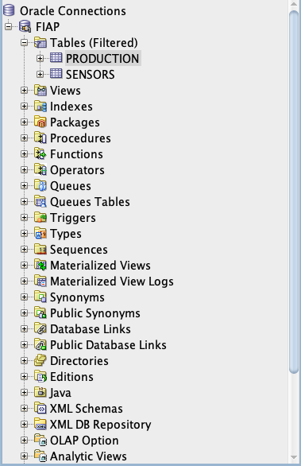

### 7.2 Criação das tabelas via DDL

Abrir [`sql/01_criar_tabela.sql`](sql/01_criar_tabela.sql) no SQL Developer (**File → Open**) e executar com **F5** (Executar Script). O script:

- Faz `DROP TABLE ... CASCADE CONSTRAINTS` defensivo em bloco PL/SQL que ignora `ORA-00942` — pode rodar várias vezes sem erro
- Cria `PRODUCTION` com PK numérica e tipos corretos (`tons NUMBER(12,2)`, `loss_pct NUMBER(5,2)`, etc.)
- Cria `SENSORS` com PK em `farm_id`, FK `producao_id → PRODUCTION.id` e `CHECK` em `nitrogen_ok`, `phosphorus_ok`, `potassium_ok` (apenas `S` ou `N`)
- Mantém `created_at` e `recorded_at` como `VARCHAR2(25)` para evitar o erro `GDK-05058` do wizard (essas colunas não são consultadas nas 10 queries da seção 8)

### 7.3 Importação dos dados via wizard ("Inserir em tabela existente")

Com as tabelas já criadas pelo DDL, o wizard "Importar Dados" é usado apenas para popular as linhas — não para criar a estrutura. Realizado duas vezes, uma para cada CSV:

1. Árvore lateral da conexão FIAP → **Tabelas (Filtrado)** → botão direito → **Importar Dados**
2. Selecionar [`data/producao.csv`](data/producao.csv); na tela "Nome da Tabela", digitar **`PRODUCTION`** (a tabela já existe pelo DDL). O wizard reconhece e oferece a opção **"Inserir em tabela existente"** — selecionar essa
3. Avançar pelas telas de mapeamento — os tipos do destino vêm da DDL, o wizard apenas faz `INSERT`
4. Repetir o fluxo apontando para [`data/sensores.csv`](data/sensores.csv) na tabela **`SENSORS`**

### 7.4 Validação com `SELECT *`

Após a importação, conferindo o conteúdo das duas tabelas:

```sql
SELECT * FROM PRODUCTION;
```

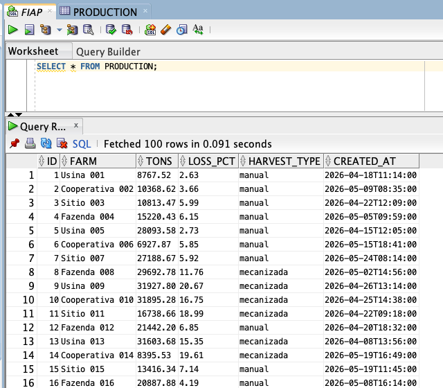

```sql
SELECT * FROM SENSORS;
```

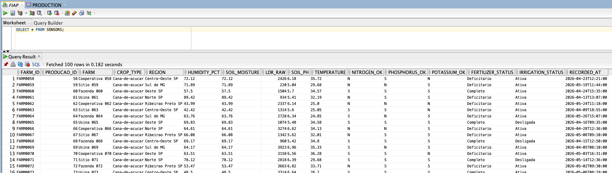

Confirmação adicional do volume:

```sql
SELECT 'PRODUCTION' AS tabela, COUNT(*) AS total FROM PRODUCTION
UNION ALL
SELECT 'SENSORS', COUNT(*) FROM SENSORS;
```

Resultado esperado: **100 linhas em cada tabela**.

## 8. Consultas SQL exploratórias

Dez consultas executadas sobre as tabelas importadas: oito sobre `SENSORS` (dados de campo do CAP1) e duas com `JOIN` para `PRODUCTION` (relação 1:1 com os lotes de colheita do CAP6). Cada bloco mostra a query, o print do resultado obtido no SQL Developer e uma breve descrição do propósito. A interpretação completa dos resultados está na [seção 9](#9-análise-dos-resultados).

### Consulta 1 — Leituras dos sensores

```sql
SELECT farm_id, farm, humidity_pct, temperature, irrigation_status
FROM SENSORS;
```

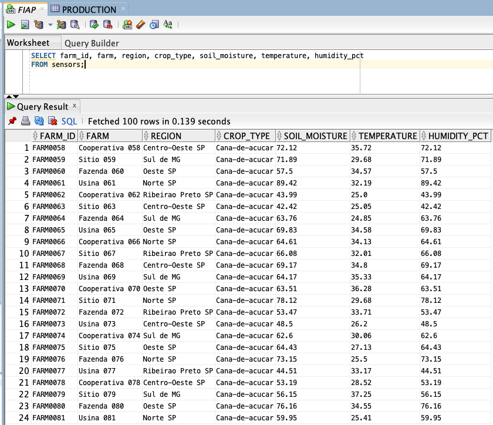

**Propósito:** visão geral das leituras de campo — cada linha mostra a fazenda, umidade, temperatura e estado da irrigação.

### Consulta 2 — Irrigação ativa (regra do firmware)

```sql
SELECT farm, humidity_pct, nitrogen_ok, phosphorus_ok, potassium_ok, irrigation_status
FROM SENSORS
WHERE irrigation_status = 'Ativa';
```

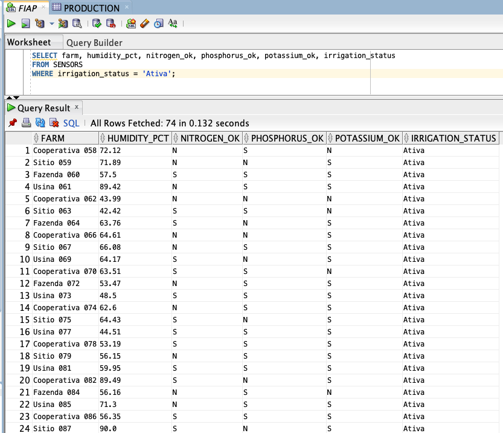

**Propósito:** filtra apenas as fazendas com relé acionado, expondo NPK e umidade na mesma linha para inspeção da regra de disparo do firmware (`humidity_pct < 60` **ou** algum NPK em `N`).

### Consulta 3 — Umidade abaixo de 60%

```sql
SELECT farm, humidity_pct, irrigation_status
FROM SENSORS
WHERE humidity_pct < 60
ORDER BY humidity_pct;
```

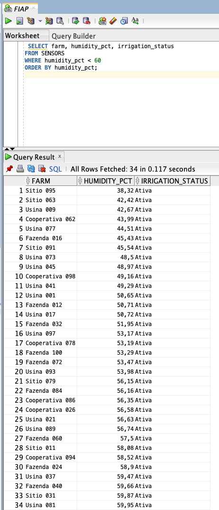

**Propósito:** lista fazendas abaixo do limiar de 60% de umidade (condição primária que aciona a irrigação no CAP1), ordenadas da mais crítica para a menos.

### Consulta 4 — Total de fazendas monitoradas

```sql
SELECT COUNT(*) AS total_fazendas FROM SENSORS;
```

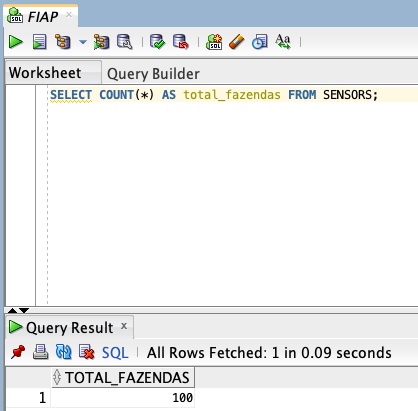

**Propósito:** validação do volume importado — deve retornar 100, confirmando carga completa via wizard.

### Consulta 5 — Temperatura média (DHT22)

```sql
SELECT ROUND(AVG(temperature), 2) AS temperatura_media FROM SENSORS;
```

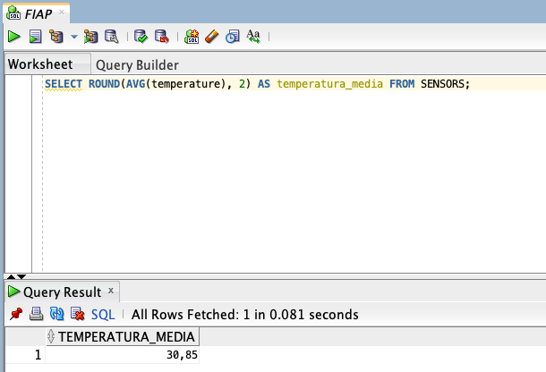

**Propósito:** temperatura média do parque monitorado pelo DHT22, agregada via `AVG` sobre todas as leituras.

### Consulta 6 — Fazendas com NPK completo

```sql
SELECT farm, fertilizer_status
FROM SENSORS
WHERE nitrogen_ok = 'S' AND phosphorus_ok = 'S' AND potassium_ok = 'S';
```

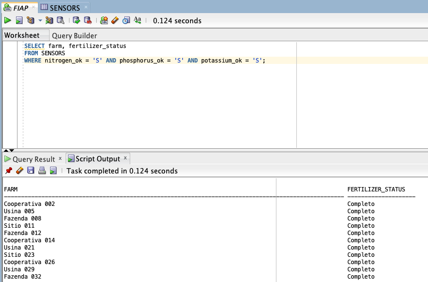

**Propósito:** isola fazendas com solo sem deficiência nutricional (N, P e K = `S`).

### Consulta 7 — Distribuição por status de irrigação

```sql
SELECT irrigation_status, COUNT(*) AS quantidade
FROM SENSORS
GROUP BY irrigation_status;
```

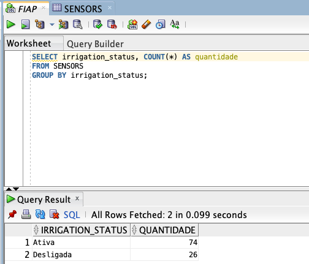

**Propósito:** distribuição do parque entre irrigando e ocioso no instante da leitura, via `GROUP BY`.

### Consulta 8 — Umidade média por região

```sql
SELECT region, ROUND(AVG(humidity_pct), 2) AS umidade_media
FROM SENSORS
GROUP BY region
ORDER BY umidade_media DESC;
```

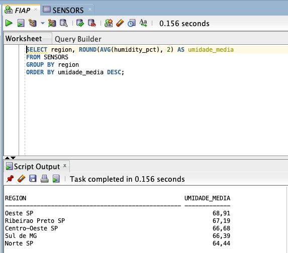

**Propósito:** ranking das regiões pela umidade média (`GROUP BY region` + `AVG`), ordenado da mais úmida para a mais seca.

### Consulta 9 — JOIN produção × sensores

```sql
SELECT p.farm           AS "Fazenda",
         p.tons           AS "Toneladas",
         p.loss_pct       AS "Perda (%)",
         p.harvest_type   AS "Tipo de colheita",
         s.humidity_pct   AS "Umidade (%)",
         s.irrigation_status AS "Irrigação",
         s.fertilizer_status AS "Adubo"
  FROM PRODUCTION p
  INNER JOIN SENSORS s ON s.producao_id = p.id;
```

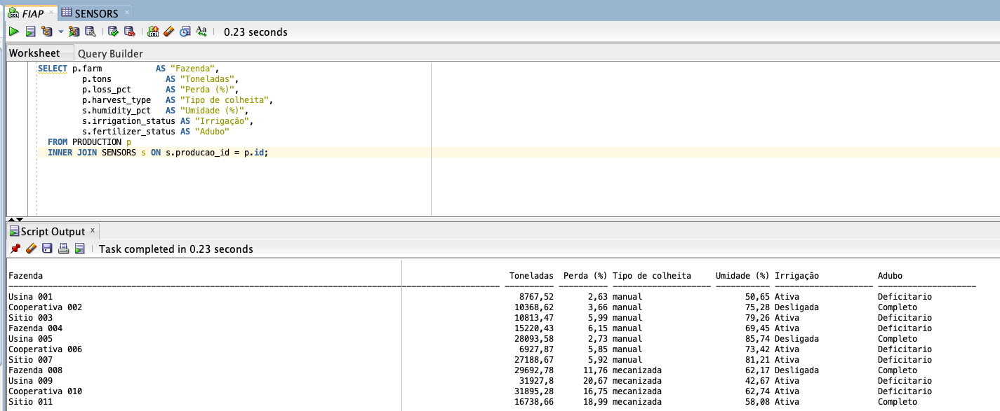

**Propósito:** combina lotes de colheita (CAP6) com leituras de sensores (CAP1) via `INNER JOIN ON s.producao_id = p.id`, materializando a relação 1:1 entre as fases. Demonstra também o uso de aliases (`AS "..."`) para apresentar o resultado com nomenclatura amigável ao negócio — útil quando o destinatário é o produtor, não o time técnico.

### Consulta 10 — Colheita mecanizada com irrigação ativa

```sql
SELECT p.farm, p.loss_pct, s.humidity_pct, s.irrigation_status
FROM PRODUCTION p
INNER JOIN SENSORS s ON s.producao_id = p.id
WHERE p.harvest_type = 'mecanizada' AND s.irrigation_status = 'Ativa'
ORDER BY p.loss_pct DESC;
```

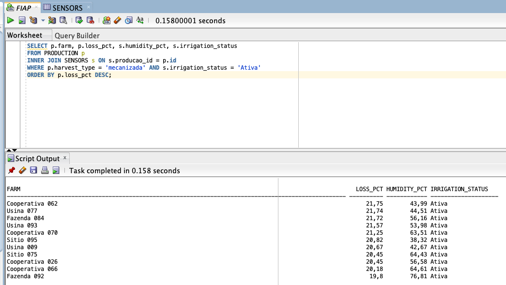

**Propósito:** cruza colheita mecanizada com irrigação ativa, ordenado por `loss_pct` decrescente — destaca os lotes com maior perda potencial sob essas duas condições.

## 9. Análise dos resultados

Análise interpretativa das 10 consultas SQL executadas sobre os 100 registros importados das tabelas `PRODUCTION` e `SENSORS`.

### 9.1 Métricas obtidas

| Métrica                                   | Consulta | Valor obtido                    |
| ----------------------------------------- | -------- | ------------------------------- |
| Total de fazendas monitoradas             | 4        | 100                             |
| Temperatura média (°C)                    | 5        | 30,85 (mín. 23,47 / máx. 37,96) |
| Fazendas com NPK completo (N=S, P=S, K=S) | 6        | 43 de 100 (43%)                 |
| Irrigação `Ativa` vs. `Desligada`         | 7        | Ativa: 74 / Desligada: 26       |
| Região com maior umidade média            | 8        | Oeste SP — 68,91%               |
| Pares JOIN produção × sensores            | 9        | 100 (relação 1:1 confirmada)    |
| Lotes mecanizados com irrigação ativa     | 10       | 42 lotes (perda média 17,13%)   |

### 9.2 Interpretação por consulta

**Consultas 1–3 — Estado do campo e regra de irrigação**

A leitura geral da C1 cobre as 100 fazendas com seus indicadores-chave (umidade, temperatura, status do relé), servindo como inspeção visual antes das agregações. A C2 revela que **74 das 100 fazendas (74%) estão com irrigação ativa**, e a C3 mostra que **34 estão abaixo do limiar de 60% de umidade**. Os dois números são coerentes com a regra do firmware: das 74 ativas, 17 foram disparadas exclusivamente por umidade baixa, 40 só por NPK em estado N, e 17 pelas duas condições — confirmando que o sistema considera tanto déficit hídrico quanto carência nutricional.

**Consultas 4–6 — Agregações sobre os sensores**

A C4 valida o volume importado retornando exatamente **100 registros**, confirmando carga completa via wizard. A C5 indica temperatura média ambiental de **30,85 °C** (variando de 23,47 °C a 37,96 °C), próxima do limiar de "calor alto" (32 °C) definido no firmware — sugerindo estresse térmico em parte significativa do parque. A C6 mostra que apenas **43 das 100 fazendas (43%) têm NPK completo**, ou seja, a maioria do parque apresenta alguma deficiência nutricional declarada — o que explica por que o NPK é o principal driver da irrigação no dataset (57 das 74 ativas envolvem NPK baixo).

**Consultas 7–8 — Distribuição operacional e geográfica**

A C7 confirma a distribuição binária do status do relé: **74 ativas vs. 26 desligadas** — 74% do parque consumindo água e energia simultaneamente no instante da leitura. A C8 ranqueia as cinco regiões pela umidade média: Oeste SP (68,91%), Ribeirão Preto SP (67,19%), Centro-Oeste SP (66,68%), Sul de MG (66,39%) e Norte SP (64,44%). As médias estão **muito próximas entre si** (delta de apenas 4,47 pontos percentuais entre extremos), indicando que a variabilidade de umidade é maior dentro de cada região do que entre regiões — a distribuição geográfica simulada é praticamente homogênea.

**Consultas 9–10 — Cruzamento CAP1 ↔ CAP6**

A C9 retorna exatamente **100 linhas** no `JOIN`, validando a relação 1:1 entre `PRODUCTION` e `SENSORS` via `producao_id`. A C10 identifica **42 lotes mecanizados com irrigação ativa**, ordenados por perda decrescente: o top 5 concentra perdas entre 21,25% e 21,75%. A perda média desse subgrupo é de **17,13%**, significativamente maior que a média geral do parque (11,22%) — uma diferença de cerca de 6 pontos percentuais que sugere correlação operacional entre colheita mecanizada sob irrigação ativa e maior perda de produto.

### 9.3 Síntese geral

Tomadas em conjunto, as 10 consultas revelam três observações principais sobre o parque simulado de 100 fazendas (~1,85 milhão de toneladas distribuídas em colheita manual e mecanizada):

1. **A deficiência nutricional é o principal gatilho da irrigação automatizada** — 57 das 74 ativações envolvem NPK em estado baixo, contra 17 puramente por umidade. Isso desloca o foco operacional de "regar mais" para "tratar o solo", já que o sistema atual reage ao sintoma (NPK) com a ação errada (água).

2. **A relação relacional 1:1 entre `PRODUCTION` e `SENSORS` permite identificar padrões cruzados** que nenhum dos sistemas da Fase 2 conseguiria isoladamente. O caso da C10 ilustra isso: só quando combinamos `harvest_type` (CAP6) com `irrigation_status` (CAP1) emerge o padrão de perda elevada (17%) em lotes mecanizados sob irrigação ativa — um insight que demanda os dois domínios juntos.

3. **A homogeneidade geográfica simulada limita conclusões sobre o eixo regional** (delta de apenas 4 pp de umidade entre extremos). A variabilidade explicativa está nas leituras individuais, não na geografia — qualquer ação operacional deve ser tomada por fazenda, não por região.

**Limitações da análise.** Todos os dados são simulados via `gerar_dados_massa.py` com seed fixa (42), de modo que os padrões observados são artefatos da distribuição configurada e não refletem operação real. Não há série temporal: cada fazenda tem uma única leitura instantânea, impossibilitando análise de evolução, sazonalidade ou tendência. As regras de disparo da irrigação são determinísticas (`humidity_pct < 60` **ou** algum NPK em `N`), o que cria correlações exatas que em dados reais seriam ruidosas.

## 10. Dificuldades e soluções

| Problema encontrado                                                                                                 | Solução adotada                                                                                                                                                                                                                                                                                                                                                                                             |
| ------------------------------------------------------------------------------------------------------------------- | ----------------------------------------------------------------------------------------------------------------------------------------------------------------------------------------------------------------------------------------------------------------------------------------------------------------------------------------------------------------------------------------------------------- |
| Erro `ORA-01722: invalid number` ao executar a Consulta 3 (`WHERE humidity_pct < 60`) após importar via wizard puro | O wizard "Importar Dados" inferiu colunas numéricas (`humidity_pct`, `temperature`, etc.) como `VARCHAR2`, impedindo qualquer filtro/agregação numérica. Tentamos converter com `ALTER TABLE ... MODIFY ... NUMBER`, mas o Oracle bloqueou (erro `ORA-01439`: "column to be modified must be empty to change datatype"). Resolvido pivotando para o fluxo DDL-first descrito na seção 7                     |
| Erro `GDK-05058: non-numeric character found` no wizard ao importar `created_at` em tabela com tipo `TIMESTAMP`     | O parser do wizard não digere o separador `T` do formato ISO 8601 (`2026-04-18T11:14:00`) presente nos CSVs gerados pelo script Python. Como `created_at` e `recorded_at` não são consultados em nenhuma das 10 queries da seção 8, o DDL [`sql/01_criar_tabela.sql`](sql/01_criar_tabela.sql) declara essas colunas como `VARCHAR2(25)` — preservando o conteúdo textualmente e desbloqueando a importação |
| Wizard cria tabelas com tipos genéricos, sem `PRIMARY KEY`, `FOREIGN KEY` nem `CHECK`                               | Fluxo final adotado (seção 7): executar o DDL primeiro para garantir a modelagem correta (PK, FK em `producao_id`, CHECK em N/P/K, tipos numéricos) e usar o wizard apenas com a opção **"Inserir em tabela existente"**                                                                                                                                                                                    |
| Erro `ORA-00955` (tabela já existe) ao reexecutar o DDL após o primeiro `CREATE`                                    | `sql/01_criar_tabela.sql` envolve cada `DROP TABLE` em bloco `BEGIN/EXCEPTION` que ignora `ORA-00942` — o script ficou idempotente e pode ser rodado quantas vezes for necessário                                                                                                                                                                                                                           |
| Reimportação acumulando dados entre testes                                                                          | `sql/00_limpar_dados.sql` faz `DELETE` em ambas as tabelas antes de uma nova carga via wizard                                                                                                                                                                                                                                                                                                               |
| Dados de teste pouco significativos para `AVG`/`GROUP BY` (versão inicial com 5 registros)                          | Volume aumentado para **100 registros** via `python3 scripts/gerar_dados_massa.py --count 100` (seed fixa = 42 para reprodutibilidade entre integrantes)                                                                                                                                                                                                                                                    |

## 11. Conclusão

A Fase 3 consolidou o aprendizado de modelagem relacional aplicando-o sobre dados reais já gerados pelo grupo nas fases anteriores: as leituras IoT do firmware ESP32 (`FASE2/CAP1`) e os lotes de colheita da CLI Python (`FASE2/CAP6`) foram unificados em duas tabelas Oracle relacionadas 1:1 via `producao_id`. Modelar essa relação em SGBD nos forçou a explicitar contratos que antes só existiam implicitamente nas aplicações da Fase 2 — chaves primárias, tipos numéricos com precisão definida, constraints de domínio em N/P/K, e a chave estrangeira que materializa a ligação entre os dois capítulos. O exercício deixou claro como a etapa de modelagem é tão importante quanto a coleta: dados gerados sem garantias de integridade no nível do banco são frágeis a inconsistências silenciosas.

A importação via wizard "Importar Dados" do SQL Developer mostrou-se conveniente para o primeiro contato com o fluxo, mas com limitações importantes: a inferência automática de tipos a partir do CSV não preserva semântica numérica (gerou `VARCHAR2` em colunas como `humidity_pct`, causando erro `ORA-01722` em filtros do tipo `< 60`) e o parser do wizard não digere o separador `T` do ISO 8601 (erro `GDK-05058` em campos como `created_at`). A solução adotada foi declarar a modelagem explicitamente em [`sql/01_criar_tabela.sql`](sql/01_criar_tabela.sql) — com tipos numéricos, `PRIMARY KEY`, `FOREIGN KEY` e `CHECK` constraints corretos — e usar o wizard apenas para a carga, escolhendo "Inserir em tabela existente". Combinar DDL declarativo com wizard para INSERT acabou sendo o caminho mais robusto e ensinou na prática a diferença entre "fazer o dado entrar no banco" e "modelar o banco corretamente".

Sobre os dados em si, as 10 consultas SQL revelaram padrões que nenhuma das duas aplicações da Fase 2 conseguiria isoladamente. A maioria das ativações de irrigação no parque simulado (cerca de 77% das 74 fazendas com relé acionado) envolve NPK em estado baixo, e não umidade — sugerindo que o sistema reage a um sintoma de solo com a ação errada (água). O `JOIN` entre `PRODUCTION` e `SENSORS` permitiu cruzar o tipo de colheita com o estado dos sensores no mesmo lote, expondo um padrão de perda elevada (17,13% em média) em colheita mecanizada sob irrigação ativa, contra 11,22% na média geral do parque. Mais relevante do que os números absolutos — que são, afinal, simulados — é a demonstração de que persistir em banco relacional viabiliza análises cruzadas que, mantendo os arquivos CSV/JSON da Fase 2 isolados, seriam tediosas ou impossíveis. Como evolução natural, o próximo passo seria adicionar série temporal aos sensores (várias leituras por fazenda ao longo do tempo) para habilitar análises de tendência, sazonalidade e detecção de anomalia.

## 12. Programa Ir Além — Dashboard

Três dashboards interativos (Streamlit multipágina + Dash em abas) sobre os mesmos dados, cobrindo as variáveis exigidas no barema (umidade, P, K, pH, status de irrigação, sugestões baseadas em clima).

```bash
cd ANO1/FASE3/CAP1
pip install -r dashboard/requirements.txt
streamlit run dashboard/Home.py
```

### Como funciona internamente

O dashboard **não conecta no Oracle** — ele lê dos mesmos CSVs gerados na seção 4 (`data/producao.csv` e `data/sensores.csv`), usando `pandas`.

A arquitetura interna do dashboard tem três camadas:

1. **`lib/data.py`** — carregadores (`load_sensores`, `load_producao`, `load_integrado`) e constantes de regra de negócio espelhadas do firmware da Fase 2: `UMIDADE_MINIMA = 60`, `PH_IDEAL = 5.5–6.5`, `TEMP_ALTA = 32 °C`, `PRECO_TONELADA_BRL = 120`.
2. **`lib/labels.py`** — traduz nomes técnicos para linguagem do produtor (`humidity_pct` → "Umidade do ar (%)", `nitrogen_ok = 'N'` → "Baixo") e contém a função `sugestao_simples()` que aplica as regras de irrigação/clima para gerar a coluna **"O que fazer?"** da página 3.
3. **`pages/*.py`** — três páginas Streamlit que o framework detecta automaticamente, ordenadas pelo prefixo numérico (`1_`, `2_`, `3_`). Cada página é independente: importa do `lib/`, carrega os dados, aplica filtros via `st.sidebar` e renderiza com `plotly.express`.

A integração com os dados da Fase 2 acontece em `load_integrado()`, que faz `merge` entre `sensores` e `producao` via `producao_id ↔ id` — replicando em `pandas` a mesma relação 1:1 que existe no Oracle (`JOIN` da Consulta 9 na seção 8).

### Páginas

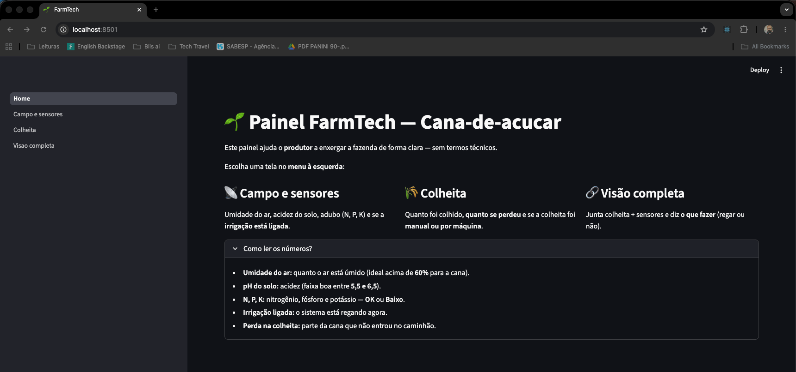

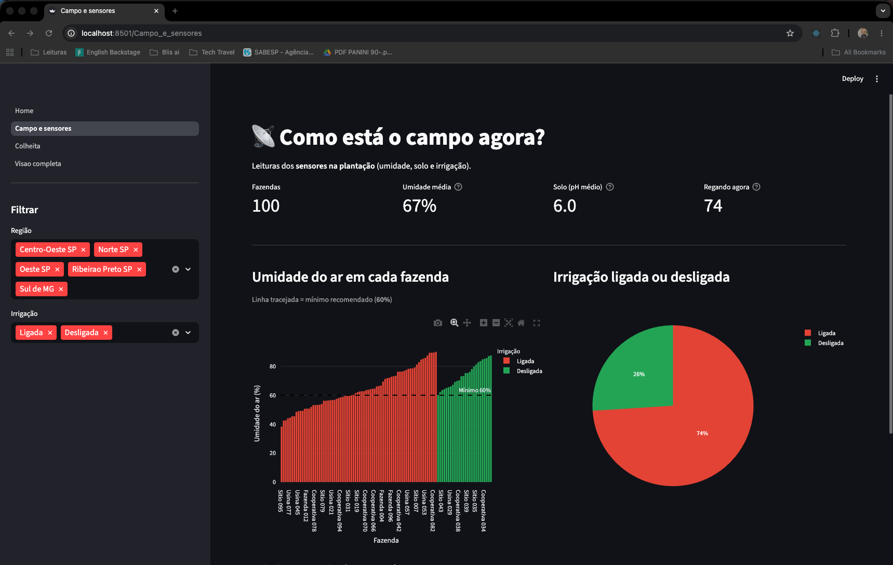

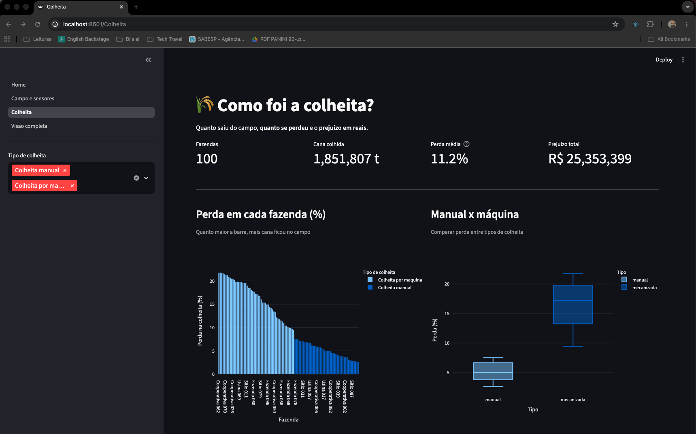

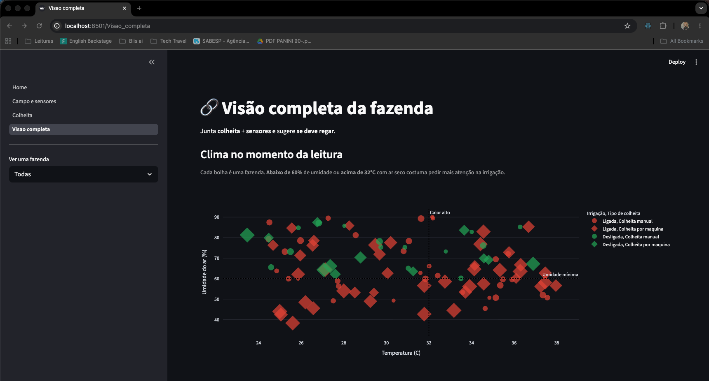

Detalhes adicionais e alternativa em Dash (`dashboard/dash_app.py`): [`dashboard/README.md`](dashboard/README.md).

## 13. Vídeo demonstrativo

Vídeo único (≤ 5 min) cobrindo o fluxo Oracle (entrega obrigatória) e os dashboards (Ir Além), gravado conforme [`ROTEIRO-VIDEO-UNICO.md`](ROTEIRO-VIDEO-UNICO.md). Publicado como **não listado** no YouTube:

**Link:** `<COLAR LINK APÓS GRAVAR>`

## 14. Estrutura do repositório

```
ANO1/FASE3/CAP1/
├── README.md                  # entrega completa (este arquivo)
├── ROTEIRO-VIDEO-UNICO.md     # roteiro do vídeo
├── data/
│   ├── producao.csv           # 100 lotes de colheita (CAP6)
│   ├── sensores.csv           # 100 leituras IoT (CAP1)
│   └── producao_fase2.json
├── sql/
│   ├── 00_limpar_dados.sql
│   ├── 01_criar_tabela.sql       # DDL opcional (PK/FK/CHECK)
│   └── 02_inserir_dados.sql      # fallback (5 INSERTs)
├── scripts/
│   ├── dados_fase2.py         # lógica de geração CAP1 + CAP6
│   ├── gerar_csv.py           # amostra pequena (5 registros)
│   └── gerar_dados_massa.py   # geração em volume
├── dashboard/
│   ├── Home.py                # Streamlit (entrada)
│   ├── dash_app.py            # Dash (alternativa)
│   ├── pages/                 # páginas Streamlit
│   ├── lib/                   # data loaders + labels
│   ├── README.md
│   └── requirements.txt
└── prints/                    # capturas do Oracle e dashboards
```

## 15. Como executar localmente

```bash
# A partir da raiz do repositório
cd ANO1/FASE3/CAP1

# (Opcional) regerar os CSVs com 100 registros — usa só stdlib do Python
python3 scripts/gerar_dados_massa.py --count 100

# Em macOS/Linux recentes, criar e ativar um venv antes do pip
# (evita o erro PEP 668 "externally-managed-environment" e o "command not found: pip")
python3 -m venv .venv && source .venv/bin/activate

# Rodar os dashboards (Streamlit + Plotly)
pip install -r dashboard/requirements.txt
streamlit run dashboard/Home.py
```

No Oracle SQL Developer: importar os dois CSVs via wizard "Importar Dados" (tabelas `PRODUCTION` e `SENSORS`) e executar as 10 consultas que estão inline na seção 8 deste README.

## 16. Referências

- Material da Fase 2: [`FASE2/CAP1`](../../FASE2/CAP1/) (firmware ESP32) e [`FASE2/CAP6`](../../FASE2/CAP6/) (CLI Python)
- Oracle SQL Developer — Download: https://www.oracle.com/database/sqldeveloper/technologies/download/
- PBL FIAP — Estrutura do curso: https://xmind.ai/share/LwsoOKB2?xid=oErUWyET
